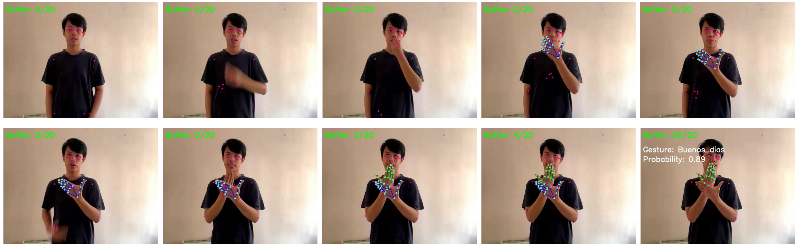
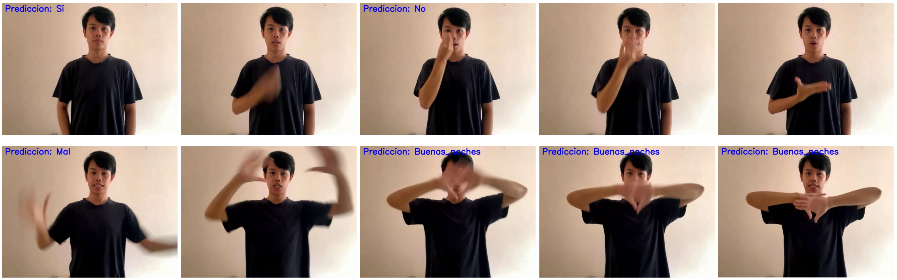

# Development of a Prototype System for Spanish Sign Language Recognition

## Introduction

Communication is essential for social interaction, but deaf individuals and those with speech impairments face challenges. This project aims to bridge this gap by developing a prototype system that recognizes and translates Spanish Sign Language (SSL) gestures into text using machine learning and computer vision.

## Objectives

This project aims to design and develop a prototype system that can recognize SSL gestures and translate them into text using a combination of computer vision and machine learning techniques. Two strategies will be compared to determine which provides better performance and accuracy:

1. A Support Vector Machine (SVM) model trained on body reference points detected in video frames.
2. A Convolutional Neural Network (CNN) model trained directly on videos, treating frames as matrices.

## Methodology

### 1. **Data Collection and Processing** <br>
Two datasets were used:
  - **Online Platforms Dataset**: Videos of SSL gestures were collected from platforms like BCBL, ARASAAC, SPREADTHESIGN, and EDUCASAAC using web scraping techniques.
  - **Custom Dataset**: A set of 14 common gestures was recorded under various conditions to improve model generalization.
Videos were processed to standardize resolution, color (grayscale), and frame count. Data augmentation techniques were applied to expand the dataset.

### 2. **Model Implementation**: 
   - **SVM Approach** <br>
     - Google’s Mediapipe library was used to extract body and hand reference points.
     - The extracted reference points were stored in a structured dataset.
     - The SVM model was trained on these reference points.

   - **CNN Model** <br>
     - Videos were processed into frames and stored as matrices.
     - A CNN model was trained using these matrices.
     - Gesture classes were encoded as binary vectors for output classification.
    
### 3. **Evaluation** <br>
Models were tested for real-time gesture prediction.

## Results & Conclusion
- **SVM Accuracy**: 52.80% (SVM1) and 56.20% (SVM2).
- **CNN Accuracy**: 70.24% (CNN1) and 71.30% (CNN2).
- CNN models demonstrated superior accuracy and robustness for real-time gesture recognition.

This project provides a strong foundation for improving communication accessibility through sign language recognition technology.

## Demos
**SVM** <br>
<!-- "Buenos días" gesture sequence -->
||
|:--:|
|*Figure 1: Gesture "Buenos días" recognition by SVM1 model*|

SVM model demo
||
|:--:|
|*Figure 2: SVM model real-time gesture recognition demonstration*|

**CNN** <br>
"Buenas noches" gesture sequence
||
|:--:|
|*Figure 3: Model CNN2 "Buenas noches" gesture recognition*|

CNN model demo
||
|:--:|
|*Figure 4: CNN model real-time gesture recognition demonstration*|


---
# How to use
### System requirements
It is very important to have at least Python 3.10 installed on your system!

### Execution of the script
From the directory:
1) Prepare the virtual environment: Execute the following command to prepare the virtual environment and install the 
dependencies:
   
   	``` sh
    python3 .\setup_and_run.py
    ```

2) Select the model to load: Select which model you want to load.
Choose between the following models:

   - 1: CNN1
   - 2: CNN2
   - 3: SVM1
   - 4: SVM2

3) Check the prediction capacity of the models: Once the model has been selected, it is possible to check its 
prediction capacity in real time.
